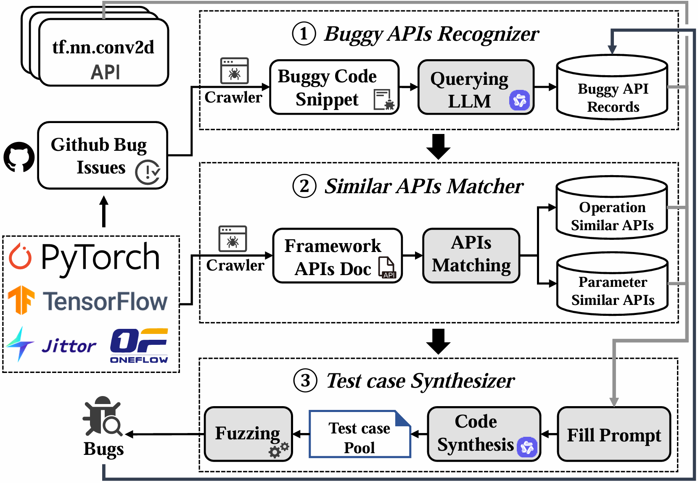

## This repository contains the source code for "MirrorFuzz: Fuzzing Deep Learning Framework APIs using LLMs and Shared Bugs." 
Some of our code and data are still being organized and will be updated in a few weeks.

[Here is the list of bugs discovered by MirrorFuzz.]()
## MirrorFuzz Introduction
Deep Learning (DL) frameworks form the backbone of many AI applications. However, bugs in these frameworks can lead to critical failures, impacting performance, security, and reliability. Despite various bug detection methods, little research has been done on identifying common patterns in APIs across DL frameworks and the risks posed by shared bugs. Many DL frameworks expose similar APIs, which makes them susceptible to analogous bugs that can spread across multiple frameworks.

MirrorFuzz is an automated fuzzing tool designed to detect shared bugs across APIs in deep learning frameworks. By recognizing common patterns and vulnerabilities in similar APIs across frameworks, MirrorFuzz enhances the efficiency of bug detection and improves the security of AI systems. It works in three stages: first, it identifies buggy APIs using historical bug reports; second, it matches similar APIs within and across frameworks; and third, it generates test cases using large language models (LLMs) to trigger shared bugs.

Evaluated on TensorFlow, PyTorch, OneFlow, and Jittor, MirrorFuzz demonstrates significant improvements in bug detection. It increases code coverage by 39.92% on TensorFlow and 98.20% on PyTorch compared to existing methods. Moreover, it discovers 315 bugs, 262 of which are new, and contributes to fixing 80 bugs, with 52 assigned CNVD IDs.

MirrorFuzz offers a powerful solution to identify and mitigate shared bugs in deep learning frameworks, improving their reliability and security for Deep Learning frameworks.

