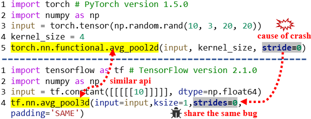

## This repository contains the source code for "MirrorFuzz: Fuzzing Deep Learning Framework APIs using LLMs and Shared Bugs." 
Some of our code and data are still being organized and will be updated in a few weeks.

[Here is the list of bugs discovered by MirrorFuzz.](https://github.com/MirrorFuzz/MirrorFuzz/blob/main/MirrorFuzz_bug_list.xlsx)
## Shared Bugs in Deep Learning frameworks

Deep Learning (DL) frameworks form the backbone of many AI applications. However, bugs in these frameworks can lead to critical failures, impacting performance, security, and reliability. Despite various bug detection methods, little research has been done on identifying common patterns in APIs across DL frameworks and the risks posed by shared bugs. Many DL frameworks expose similar APIs, which makes them susceptible to analogous bugs that can spread across multiple frameworks.

  
  
<strong>Figure 1:</strong> shared bug example.

## MirrorFuzz Introduction

  
  
<strong>Figure 2:</strong> MirrorFuzz overview.

To address this issue, we present MirrorFuzz, an automated fuzzing tool that exploits shared bugs within and across DL framework APIs. MirrorFuzz operates in three stages:

- Buggy APIs Recognition: It collects historical error data from various DL frameworks and utilizes large language models (LLMs) to identify potential buggy APIs.

- Similar APIs Matching: It classifies the matched similar APIs into parameter-similar APIs and operation-similar APIs based on the shared bug manifestations, while considering both text and semantic similarity for API matching.

- Test Case Synthesis: Using LLMs, it generates test cases to trigger analogous bugs across matched APIs by leveraging shared historical bug data.

We evaluate MirrorFuzz on four popular DL frameworks: TensorFlow, PyTorch, OneFlow, and Jittor. Our experiments show that MirrorFuzz improves code coverage by 39.92% on TensorFlow and 98.20% on PyTorch compared to state-of-the-art methods. Additionally, it uncovers 315 bugs, 262 of which are previously unknown, and contributes to fixing 80 bugs, with 52 assigned CNVD IDs.

More importantly, our research shows that bugs in leading frameworks like TensorFlow and PyTorch can propagate to many other frameworks. Additionally, bugs in smaller or newer frameworks like OneFlow and Jittor can affect mainstream frameworks, highlighting the widespread impact of shared bugs across deep learning frameworks.

MirrorFuzz offers a powerful solution to identify and mitigate shared bugs across deep learning frameworks, enhancing their reliability and security.
